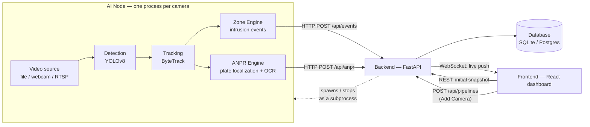
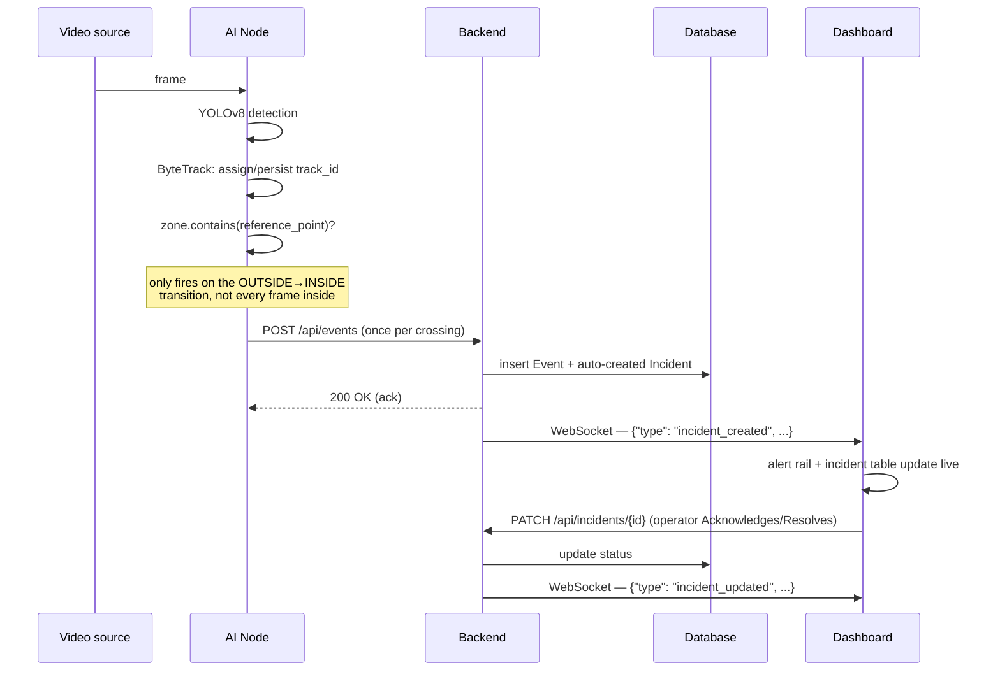
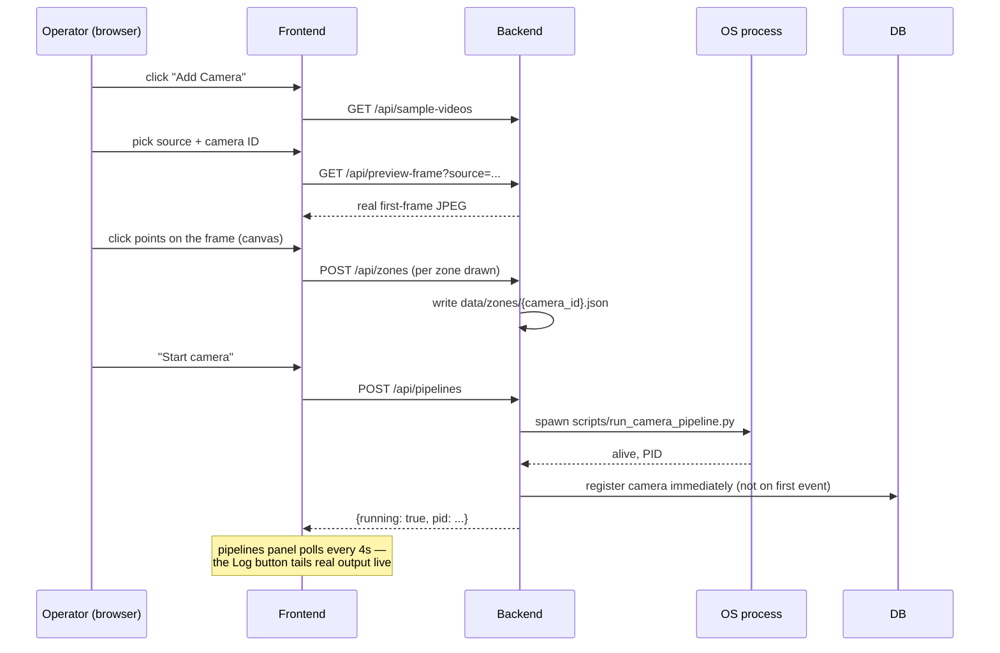

# IBVAP — Intelligent Border Video Analytics Platform

**Turning existing CCTV infrastructure into an AI-powered surveillance network — no proprietary smart-camera hardware required.**

Built for Smart India Hackathon Problem Statement 187. IBVAP ingests standard IP/webcam/file video streams and layers real-time computer vision — detection, multi-object tracking, restricted-zone intrusion alerts, and automatic number plate recognition — on top, surfacing everything through a live operator dashboard.

---

## Table of contents

- [What this is](#what-this-is)
- [What's actually built](#whats-actually-built)
- [Architecture](#architecture)
- [Quickstart — what happens first](#quickstart--what-happens-first)
- [How data moves through the system](#how-data-moves-through-the-system)
- [Project structure](#project-structure)
- [Tech stack](#tech-stack)
- [API surface](#api-surface)
- [Known limitations](#known-limitations)
- [Future scope](#future-scope)
- [Further reading](#further-reading)

---

## What this is

Border security forces deploy CCTV widely, but conventional systems are passive — they record, they don't understand. Adding real intelligence (face recognition, ANPR, intrusion detection) usually means expensive proprietary hardware, which doesn't scale to remote installations.

IBVAP is a **software-defined** answer to that: point it at a video source — a file, a webcam, or (architecturally) an RTSP IP camera — and it produces structured security intelligence (who/what crossed which boundary, when, with what confidence, and a vehicle's plate if one was involved), pushed live to a dashboard an operator actually watches.

The core design principle carried through every layer: **AI inference stays local, at the edge.** The problem statement is explicitly about remote border locations, where continuous dependence on a network connection for the actual surveillance to function would be a bad architectural fit. The backend and dashboard can live anywhere reachable; the camera-processing pipeline never has to.

## What's actually built

Checked against the original problem statement's required capabilities — this table says what's real, not what's planned:

| Capability (from the problem statement) | Status | Notes |
|---|---|---|
| Human detection and tracking | ✅ Built | YOLOv8 + ByteTrack, persistent IDs verified stable across real footage |
| Vehicle detection | ✅ Built | Same pipeline, filtered to COCO vehicle classes |
| Vehicle *classification* (car/truck/bike, etc.) | ⚠️ Partial | Detected as one generic `"vehicle"` class today, not sub-classified |
| Automatic Number Plate Recognition | ✅ Built | Classical CV plate localization + OCR, honestly reports "nothing legible" rather than guessing |
| Virtual fence / intrusion detection | ✅ Built | Polygon zones, one event per crossing (not per frame) |
| Real-time alerts + event logging | ✅ Built | WebSocket push to a live dashboard, persisted to a database |
| Multi-camera support | ✅ Built | Tested with concurrent camera processes against one backend |
| Face detection | ❌ Not built | Scoped out from the start as a later phase |
| Suspicious activity / behavioral analytics | ❌ Not built | Designed (see [Future scope](#future-scope)), not implemented |
| Night-time movement detection | ❌ Not built | No low-light-specific handling anywhere in the pipeline |
| Command & control system integration | ❌ Not built | No external C2 adapter or API contract exists yet |

## Architecture

Three independent layers. The AI Node runs one instance **per camera**; the Backend and Frontend are each a single shared instance.



Why it's shaped this way:
- **AI Node ↔ Backend is HTTP, not a shared process** — the camera pipeline keeps running and logging locally even if the backend is unreachable (verified: killed the backend mid-run, the pipeline kept processing and queued nothing lost once it came back).
- **Backend ↔ Frontend is WebSocket + REST, not WebSocket-only** — the WebSocket has zero message history, so the frontend always re-syncs via REST on reconnect rather than trusting it received everything.
- **The backend can spawn/stop AI Node processes itself** — this is what makes "Add Camera" from the browser possible instead of requiring a new terminal per camera.

## Quickstart — what happens first

```bash
pip install -r requirements.txt
python run_demo.py
```

That single command, in order:
1. Builds the frontend if it isn't built yet (`npm install && npm run build`, first run only)
2. Starts the FastAPI backend — which now serves **both** the API and the built frontend from one process (see the static mount in `backend/main.py`)
3. Opens a browser tab

From there, everything else happens in the browser: click **Add Camera**, pick a source (a bundled sample clip, a webcam index, or a custom path/RTSP URL), optionally draw a restricted zone and/or an ANPR checkpoint zone by clicking directly on a live preview frame, and start it. No further terminal commands are needed for the demo itself — the backend manages each camera's AI process as a subprocess, start to stop.

## How data moves through the system

**An intrusion event, end to end:**



**Adding a camera from the browser (the "no terminal" flow):**



The reference point used for zone-crossing checks is the **bottom-center of each tracked object's bounding box** — an approximation of ground position, not the box centroid, since a tall box's center can sit well above where a person is actually standing.

## Project structure

```
ibvap/
├── run_demo.py                  # one-command launcher — builds frontend, starts backend
├── requirements.txt
│
├── vision/                      # the CV pipeline building blocks
│   ├── video_ingest/reader.py     # FrameReader — file/webcam/RTSP → Frame(camera_id, frame_id, timestamp, image)
│   ├── detection/detector.py      # Detector — YOLOv8 wrapper, filtered to person/vehicle
│   ├── tracking/tracker.py        # Tracker — YOLOv8 + ByteTrack, adds persistent track_id
│   └── event_engine/
│       ├── zone.py                  # Zone — polygon + point-in-polygon test
│       ├── zone_config.py           # load/save zone configs to per-camera JSON
│       └── engine.py                # EventEngine — crossing detection (not per-frame), evidence, event log
│
├── anpr/                        # plate recognition
│   ├── plate_localizer.py         # classical edge/contour plate-region detection
│   ├── ocr_reader.py              # EasyOCR wrapper
│   ├── normalizer.py              # conservative text cleanup (no character "correction")
│   └── engine.py                  # ANPREngine — same crossing-trigger idiom as EventEngine
│
├── backend/                     # FastAPI service — the system's source of truth
│   ├── main.py                    # all REST + WebSocket routes
│   ├── models.py                  # Camera, Event, Incident, ANPRResult (SQLAlchemy)
│   ├── schemas.py                 # Pydantic request/response shapes
│   ├── db.py                      # SQLite by default, Postgres via DATABASE_URL — no code change needed
│   ├── ws_manager.py               # in-memory WebSocket broadcast
│   └── pipeline_manager.py         # spawns/tracks/stops AI Node subprocesses
│
├── frontend/                    # React operator dashboard (Vite + Tailwind v4)
│   ├── src/lib/
│   │   ├── api.js                   # REST client
│   │   ├── reconnectingSocket.js     # WebSocket with exponential backoff
│   │   └── useLiveBackend.js         # central data hook — REST snapshot + live WS updates
│   ├── src/components/             # CameraGrid, AlertRail, IncidentTable, ANPRTable,
│   │                                 # AddCameraModal, ZoneCanvasEditor, PipelinesPanel, ...
│   └── CommandCenterReference.jsx  # earlier mock-data reference build (kept for visual reference only)
│
├── scripts/
│   ├── run_camera_pipeline.py     # the actual per-camera process the backend spawns
│   ├── draw_zone.py               # standalone OpenCV zone-drawing tool (pre-dates the web editor)
│   └── run_phase{1..5}_demo.py    # single-phase manual test scripts, from incremental development
│
├── data/
│   ├── sample_videos/             # bundled test footage
│   ├── zones/                     # per-camera zone configs (intrusion + ANPR)
│   ├── evidence/ , anpr_evidence/ # snapshot images saved on events (gitignored contents)
│   └── pipeline_logs/             # per-camera subprocess output (gitignored)
│
├── FRONTEND_BLUEPRINT.md        # full REST/WebSocket API contract + UI requirements
└── docs/DEVELOPMENT_LOG.md      # phase-by-phase build log — what was tested and how, bugs found and fixed
```

## Tech stack

| Layer | Technology | Why |
|---|---|---|
| Video I/O | OpenCV (FFMPEG backend forced explicitly) | Broad codec support, cross-platform consistency |
| Detection | YOLOv8 (`ultralytics`) | Fast, well-supported, easy CPU/GPU portability |
| Tracking | ByteTrack (via `ultralytics`) | Guide's first-choice tracker; avoided hand-rolling Kalman/Hungarian matching |
| ANPR | Classical CV (edge/contour) + EasyOCR | No pretrained plate-detector reachable in the build environment; appropriate for the problem statement's controlled-footage scope anyway |
| Backend | FastAPI + SQLAlchemy + WebSocket | Async-friendly, typed, one framework for REST and realtime |
| Database | SQLite (dev) → Postgres (scale) | Zero-setup local dev; swap via `DATABASE_URL`, no code changes |
| Frontend | React 18 + Vite + Tailwind v4 | Fast dev loop, small bundle, per the guide's own frontend recommendation |
| Process mgmt | Python `subprocess` | Cross-platform (Windows-tested) camera process lifecycle, no extra dependency |

## API surface

Full reference — every endpoint, request/response shape, and the WebSocket protocol — lives in **[FRONTEND_BLUEPRINT.md](FRONTEND_BLUEPRINT.md)**. Summary:

| Endpoint | Purpose |
|---|---|
| `GET/POST /api/incidents`, `PATCH /api/incidents/{id}` | Intrusion incidents + operator workflow (Active → Acknowledged → Resolved) |
| `GET/POST /api/anpr` | Plate-read results |
| `GET/POST/DELETE /api/pipelines`, `GET /api/pipelines/{id}/log` | Camera process control — the "no terminal" layer |
| `GET /api/sample-videos`, `GET /api/preview-frame`, `POST /api/zones` | Add Camera flow support (source picking, live preview, zone drawing) |
| `GET /api/cameras` | Registered cameras |
| `WS /ws` | Live push: `incident_created`, `incident_updated`, `anpr_result` |

## Known limitations

Stated directly rather than left for someone to discover:

- **No authentication anywhere.** Fine for a local demo; not production-ready as-is.
- **No live video/overlay streaming.** The dashboard's camera panel shows the latest evidence *snapshot*, not a live feed — that data path doesn't exist yet. The snapshot itself is now annotated (intruder bounding box + zone border baked into the saved image, matching the dashboard's own color language), which closes most of the practical gap for reviewing a specific incident; it just isn't continuous/live.
- **ANPR-to-incident linking is approximate.** No foreign key between an `ANPRResult` and an `Event`/`Incident` — correlated client-side by camera + track ID, not guaranteed.
- **Camera "status" doesn't mean health.** It's set once when a camera first registers and never re-checked — no heartbeat/offline detection.
- **Severity is a placeholder heuristic** (confidence ≥ 0.7 → HIGH, else MEDIUM), not a real risk model.

## Future scope

Ranked roughly by value relative to effort, not by how they're listed in the problem statement:

1. **Suspicious-activity / behavioral engine** — a designed-but-unbuilt rule-based system (loitering duration, repeated fence approach, zone-dwell time) feeding a finite-state model, directly closing the largest capability gap against the problem statement.
2. **Live video overlay streaming** — an MJPEG or WebSocket frame+box stream, replacing the evidence-snapshot placeholder with what the original spec actually asked for.
3. **Local + cloud hybrid deployment** — AI inference stays on-site (see [Architecture](#architecture)); a cheap cloud VM mirrors the backend/dashboard for resilience and remote situational awareness, with a heartbeat-driven failover indicator. Deliberately *not* routing camera video through the cloud, given the problem statement's remote-location framing.
4. **Face detection** and **night-time/low-light handling** — both explicitly named in the problem statement, both deferred from day one as later-phase work.
5. **Command & control system integration** — no adapter or API contract exists yet for handing incidents to an external C2 platform.
6. **Vehicle sub-classification** (car/truck/bus/motorcycle) — currently one generic `vehicle` class; the detector already sees the finer COCO categories, this is a filtering change, not new modeling work.
7. **Weapon detection** — lowest priority; not actually named in the problem statement's capability list, and would need its own trained model rather than a fine-tune of the existing pipeline.
8. **Authentication and multi-user roles** for the dashboard.

## Further reading

- **[FRONTEND_BLUEPRINT.md](FRONTEND_BLUEPRINT.md)** — complete API contract, TypeScript data model, UI requirements
- **[docs/DEVELOPMENT_LOG.md](docs/DEVELOPMENT_LOG.md)** — the full phase-by-phase build record: what was tested, how, and every real bug found and fixed along the way
- **[frontend/README.md](frontend/README.md)** — frontend-specific setup and verification notes
